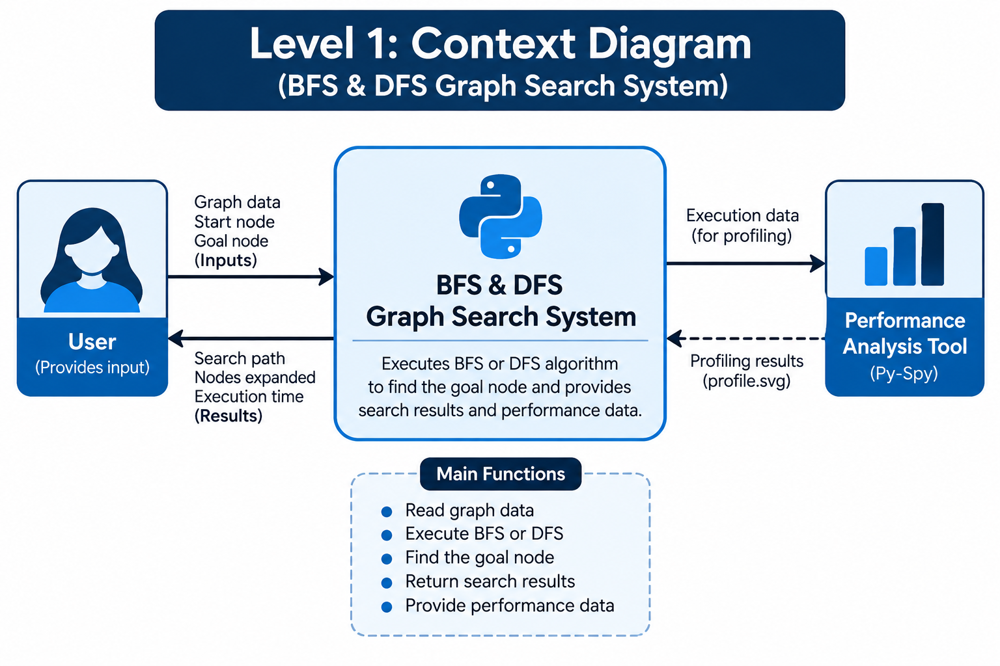
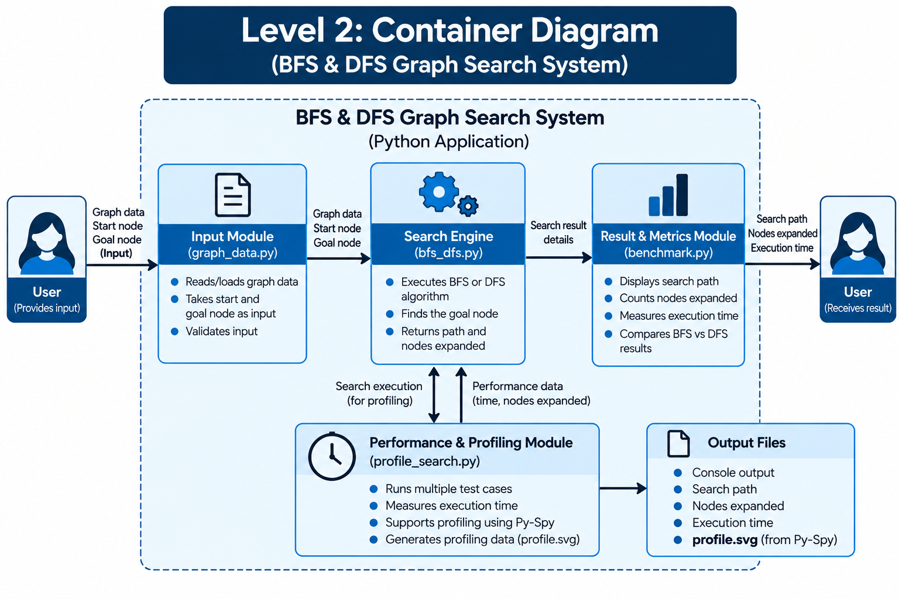
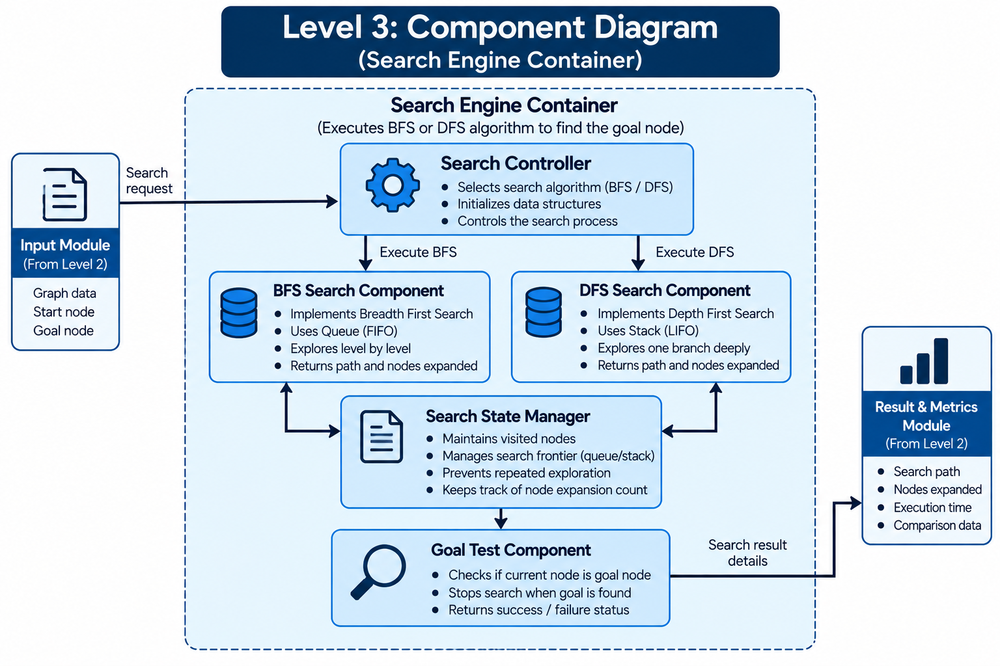
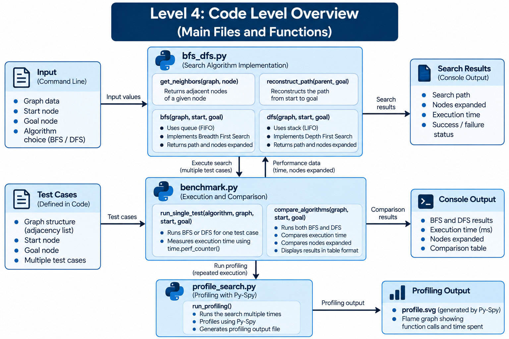

<div align="center">

# SLE-3: Architectural Design using Full C4 Model

### BFS & DFS Graph Search System

**Introduction to Artificial Intelligence (02AML204)**

</div>

---

## 👤 Student Details

| Field | Details |
|---|---|
| **Name** | Vaishnavi Sudhir Ghodake |
| **PRN** | 26UAM315 |
| **Division** | A |
| **Course** | 02AML204 – Introduction to Artificial Intelligence |

---

## 🎯 Objective

SLE-3 presents the architecture of the **BFS & DFS Graph Search System** using the complete **C4 Model**.

The system continues the BFS and DFS implementation and empirical performance analysis completed in **SLE-2**. It takes a graph, start node, and goal node as input, performs BFS or DFS, and records the search path, nodes expanded, and execution time. **Py-Spy** is used for profiling the search execution.

---

# 🏗️ C4 Model

This submission includes all four required C4 levels:

**Context → Container → Component → Code**

---

## 1️⃣ Level 1 – System Context

The Context diagram shows the system from a high-level perspective, including the user and the external performance/profiling tool.

### Diagram



### Key Interaction

- **User** provides graph data, start node, and goal node.
- **BFS & DFS Graph Search System** performs the requested search.
- The system produces the search path, nodes expanded, and execution time.
- **Py-Spy** is used for performance profiling.

---

## 2️⃣ Level 2 – Container

The Container view divides the system into its main logical building blocks.

### Diagram



### Main Containers

| Container | Responsibility |
|---|---|
| **Input Module** | Provides graph, start node, and goal node. |
| **Search Engine** | Executes BFS or DFS and returns search results. |
| **Result & Metrics Module** | Produces path, nodes expanded, and execution time. |
| **Performance & Profiling Module** | Runs repeated tests and supports Py-Spy profiling. |
| **Output** | Presents search results and generated profiling output. |

---

## 3️⃣ Level 3 – Component

The Component view focuses on the **Search Engine** container.

### Diagram



### Components

- **Search Controller** – selects BFS or DFS.
- **BFS Search Component** – performs Breadth First Search.
- **DFS Search Component** – performs Depth First Search.
- **Search State Manager** – tracks visited nodes and the frontier.
- **Goal Test Component** – checks whether the current node is the target.

> **Note:** These are logical components within the Search Engine container.

---

## 4️⃣ Level 4 – Code

The Code view connects the architecture with the actual Python files used in SLE-2.

### Diagram



### Code Units

| File | Role |
|---|---|
| `bfs_dfs.py` | Graph definition and BFS/DFS search functions. |
| `benchmark.py` | Runs best, average, and worst-case benchmarking and measures execution time. |
| `profile_search.py` | Repeats search execution for Py-Spy profiling. |
| `profile.svg` | Generated profiling output. |
| `readme.md` / `contribution.md` | Project documentation and contribution record. |

---

## 🧩 Design Decisions

- BFS and DFS are separated because **BFS uses a queue (FIFO)** while **DFS uses a stack (LIFO)**.
- Visited-node tracking avoids repeated exploration.
- The same graph and test conditions are used for a fair comparison.
- Benchmarking and profiling are separated from the core search logic.

---

## 🤖 AI Contribution

ChatGPT was used to:

- Understand the C4 Model and its four architectural levels.
- Organize the existing BFS/DFS work into the C4 architecture.
- Draft explanations and documentation.
- Assist with diagram and report preparation.

The student reviewed the SLE-2 implementation, selected the architecture, verified the code structure, and prepared the final submission.

---

## 📁 Submission Files

```text
SLE-3/
├── Level_1_Context_Diagram.png
├── Level_2_Container_Diagram.png
├── Level_3_Component_Diagram.png
├── Level_4_Code_Overview.png
├── README.md
└── SLE3_26UAM315_Vaishnavi_Ghodake_FINAL_VERIFIED.docx
